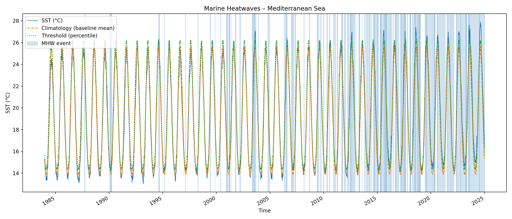
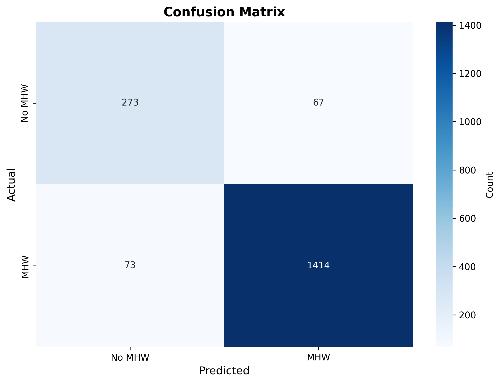

# 🌊 Marine Heatwave (MHW) Detection Toolkit – OISST v2.1

A Python toolkit for detecting and analysing **marine heatwaves (MHWs)** using **NOAA OISST v2.1 daily sea surface temperature**.

---

## 🔥 Features

- Automated NOAA OISST year-check system  
- Fast SST loading over any custom or preset region  
- Daily climatology & percentile threshold (Hobday et al., 2016)  
- Full marine heatwave event detection  
- **NEW: Machine learning prediction** (Random Forest 7-day forecasting)
- Annual summaries of MHW metrics  
- Trend analysis (linear regression + Mann–Kendall test)  
- Simple Tkinter graphical interface  

> **Note**  
> The interactive anomaly-map system was removed for stability.  
> For anomaly maps, use **Google Earth Engine** or **QGIS**.

---

## 📁 Project Structure

    mhw-oisst-toolkit/
    │
    ├── scripts/
    │   ├── main.py              # GUI + full analysis pipeline
    │   ├── main_with_ml.py      # GUI + ML prediction (NEW)
    │   ├── data_io.py           # OISST loading utilities
    │   ├── mhw_core.py          # Climatology + threshold + MHW detection
    │   ├── stats_tool.py        # Trend + MK significance testing
    │   ├── plotting.py          # Plot generation (PNG)
    │   ├── ml_features.py       # Feature engineering (NEW)
    │   ├── ml_prediction.py     # Random Forest classifier (NEW)
    │   ├── ml_plotting.py       # ML visualizations (NEW)
    │   ├── ml_workflow.py       # Standalone ML pipeline (NEW)
    │   └── example_ml_demo.py   # ML demonstration (NEW)
    │
    ├── docs/
    │   ├── ML_README.md                # ML documentation
    │   ├── IMPLEMENTATION_GUIDE.md     # ML implementation guide
    │   └── FORECAST_WINDOW_GUIDE.md    # Technical ML details
    │
    ├── plots/               # Auto-generated figures
    │   └── examples/        # Example outputs
    │
    ├── tables/              # Auto-generated CSV analysis tables
    │   └── examples/        # Example outputs
    │
    ├── README.md
    ├── requirements.txt
    └── LICENSE

---

## 🚀 Installation

1. **Clone the repository**

        git clone https://github.com/LoreVass/mhw-oisst-toolkit.git
        cd mhw-oisst-toolkit

2. **Create a virtual environment**

        python -m venv .venv
        # macOS / Linux
        source .venv/bin/activate
        # Windows
        .venv\Scripts\activate

3. **Install dependencies**

        pip install -r requirements.txt

---

## 🌐 NOAA OISST v2.1 Data

Download daily files (`sst.day.mean.YYYY.nc`) from:

https://psl.noaa.gov/data/gridded/data.noaa.oisst.v2.highres.html

Place them in a folder such as:

    C:/Users/<YOU>/Data/OISST/

The toolkit will automatically check that all required years are present.

---

## 🖥 Running the Toolkit

### Standard Version (MHW Detection Only)

Run:

    python scripts/main.py

### Enhanced Version (MHW Detection + ML Prediction)

Run:

    python scripts/main_with_ml.py

You will be asked to select:

- Region (preset or custom)
- Latitude/longitude bounds
- Analysis period
- Baseline climatology period
- Percentile threshold (default: 0.9)
- Minimum heatwave duration (default: 5 days)
- Folder containing the NOAA OISST NetCDF files
- **ML options** (forecast window, cross-validation)

Outputs are saved into:

- `plots/`
- `tables/`

---

## 🤖 Machine Learning Extension

### Overview

The toolkit now includes **predictive modeling** for marine heatwave forecasting using Random Forest classification.

### Features

- 🔮 7-day ahead MHW prediction
- 📊 30+ engineered features from SST time series
- 🌊 Basin-scale forecasting
- ✅ Temporal cross-validation
- 📈 Comprehensive evaluation metrics

### Quick Start

    # Enhanced version with ML capabilities
    python scripts/main_with_ml.py

    # Test ML on synthetic data
    python scripts/example_ml_demo.py

    # Standalone ML workflow
    python scripts/ml_workflow.py --sst <FILE> --clim <FILE> --threshold <FILE>

### Performance – Mediterranean Sea (2020–2024)

- **F1 Score:** 95.3%
- **Precision:** 95.5% (of predicted MHWs, how many were correct)
- **Recall:** 95.1% (of actual MHWs, how many were caught)
- **ROC-AUC:** 96.9%

### Cross-Validation Results (1997–2024)

- **Mean F1:** 75.9% ± 16.4%
- **Performance range:** 50.4% (early period) → 94.7% (recent period)

> **Note**  
> High performance on recent data reflects both model skill and unprecedented MHW persistence in the Mediterranean (81% of 2020–2024 days met MHW criteria vs. 21% historically). This demonstrates the model's ability to adapt to changing climate conditions.

### Top Predictive Features

1. **SST anomaly** (15.8% importance) – Current deviation from climatology
2. **Distance above threshold** (15.5% importance) – Proximity to MHW conditions
3. **Currently above threshold** (13.9% importance) – Already in warm state
4. **Recent anomaly trends** (13.8% importance) – Yesterday's conditions
5. **Fraction of recent warm days** (11.3% importance) – 30-day persistence

### Documentation

- **Full ML Documentation:** [docs/ML_README.md](docs/ML_README.md)
- **Implementation Guide:** [docs/IMPLEMENTATION_GUIDE.md](docs/IMPLEMENTATION_GUIDE.md)
- **Technical Details:** [docs/FORECAST_WINDOW_GUIDE.md](docs/FORECAST_WINDOW_GUIDE.md)

### New ML Modules

- `scripts/ml_features.py` – Feature engineering (rolling stats, anomalies, lags)
- `scripts/ml_prediction.py` – Random Forest classifier with evaluation
- `scripts/ml_plotting.py` – ML-specific visualizations
- `scripts/ml_workflow.py` – Standalone ML pipeline
- `scripts/main_with_ml.py` – Integrated detection + prediction workflow

---

## 📊 Output Files

### Figures (PNG)

**Traditional MHW Detection:**

- `mhw_timeseries_<REGION>.png`  
- `seasonal_cycle_<REGION>.png`  
- `trend_sst_annual_mean_<REGION>.png`  
- `trend_sst_annual_min_<REGION>.png`  
- `trend_sst_annual_max_<REGION>.png`  
- `trend_mhw_n_events_<REGION>.png`  
- `trend_mhw_total_mhw_days_<REGION>.png`  
- `trend_mhw_max_intensity_<REGION>.png`  
- `trend_mhw_mean_intensity_<REGION>.png`  
- `trend_mhw_longest_event_<REGION>.png`  

**ML Prediction (NEW):**

- `ml_metrics_summary_<REGION>.png`  
- `ml_prediction_timeline_<REGION>.png`  
- `ml_feature_importance_<REGION>.png`  
- `ml_confusion_matrix_<REGION>.png`  
- `ml_roc_curve_<REGION>.png`  
- `ml_pr_curve_<REGION>.png`  
- `ml_cv_results_<REGION>.png`  

### Tables (CSV)

**Traditional MHW Detection:**

- `mhw_events_<REGION>.csv`  
- `mhw_yearly_summary_<REGION>.csv`  
- `trend_significance_sst_<REGION>.csv`  
- `trend_significance_mhw_metrics_<REGION>.csv`  

**ML Prediction (NEW):**

- `ml_metrics_<REGION>.csv`  
- `ml_feature_importance_<REGION>.csv`  
- `ml_cv_results_<REGION>.csv`  

---

## 🧠 Methodology Summary

### Traditional MHW Detection

Implements the **Hobday et al. (2016)** Marine Heatwave definition:

- Daily climatology computed over a user-defined baseline period  
- Threshold = daily percentile (default: 90th)  
- A marine heatwave (MHW) is detected when:
  - SST > threshold  
  - for **N** consecutive days (default: 5)  

For each event, the toolkit computes:

- Duration  
- Mean intensity  
- Maximum intensity  
- Cumulative intensity  

Annual summary metrics are then extracted, and trends are estimated using linear regression, with significance evaluated using the **Mann–Kendall** test.

### ML Prediction (NEW)

Implements **Random Forest classification** for 7-day MHW forecasting:

- **Feature engineering:** 30+ features including rolling statistics, anomalies, seasonal patterns, and lagged variables
- **Training:** Historical data (default: 1984–2019)
- **Testing:** Recent data (default: 2020–2024)
- **Validation:** Temporal cross-validation with 5 expanding windows
- **Target:** Binary classification – will an MHW occur within the next 7 days?

The model learns physical precursors to MHW events:

- Recent warming trends
- Proximity to threshold
- Persistent anomalies
- Seasonal timing

---

## 📄 Requirements (requirements.txt)

The project requires:

    numpy>=1.21.0
    pandas>=1.3.0
    xarray>=0.19.0
    dask>=2021.9.0
    netCDF4>=1.5.7
    scipy>=1.7.0
    matplotlib>=3.4.0
    statsmodels>=0.13.0
    tqdm>=4.62.0
    
    # ML dependencies (NEW)
    scikit-learn>=1.0.0
    seaborn>=0.11.0
    
---

## 🧪 Example Run – Mediterranean Sea

The following example illustrates a typical configuration used to analyse
marine heatwaves in the **Mediterranean Sea** with ML prediction.

### Configuration

- **Latitude range:** 30.0 – 46.0 °N  
- **Longitude range:** -6.0 – 36.0 °E  
- **Analysis period:** 1984 – 2024  
- **Baseline climatology:** 1984 – 2013  
- **Percentile threshold:** 0.9 (90th percentile)  
- **Minimum event duration:** 5 days  
- **ML forecast window:** 7 days
- **ML training cutoff:** 2019-12-31

### Run command

    python scripts/main_with_ml.py

After launching the GUI, insert the parameters above when prompted and select
the folder containing the NOAA OISST v2.1 NetCDF files.

### Generated outputs

This configuration produces:

- Daily SST time series with detected marine heatwave events  
- Seasonal cycle and climatological threshold plots  
- Long-term trends in SST and marine heatwave metrics  
- **ML prediction performance metrics and visualisations**
- **Feature importance analysis**
- **Temporal cross-validation results**
- Event-level and yearly summary tables  

All outputs are automatically saved into:

- `plots/`
- `tables/`

This setup can be easily adapted to other regions by modifying the spatial
bounds and temporal coverage.

---

## 📊 Example Outputs

### Traditional MHW Detection

#### Figures (PNG)



*Full time series showing SST, climatological threshold, and detected MHW events (1984–2024).*

---

### ML Prediction (NEW)

#### Figures (PNG)


*Comprehensive performance metrics showing 95.3% F1 score with balanced precision and recall.*


*Predicted vs. actual MHW events (2020–2024) demonstrating model performance on test data.*


*Top 20 predictive features revealing physical precursors to marine heatwaves.*


*Performance across 5 temporal folds showing model robustness.*



*Error breakdown: 1414 correct MHW predictions, 273 correct non-MHW predictions.*

#### Tables (CSV)

- [`ml_metrics_Mediterranean_Sea.csv`](tables/examples/ml_metrics_Mediterranean_Sea.csv)  
  Model performance summary (accuracy, precision, recall, F1, ROC-AUC).

- [`ml_feature_importance_Mediterranean_Sea.csv`](tables/examples/ml_feature_importance_Mediterranean_Sea.csv)  
  Top 30 predictive features ranked by importance.

- [`ml_cv_results_Mediterranean_Sea.csv`](tables/examples/ml_cv_results_Mediterranean_Sea.csv)  
  Cross-validation results across 5 temporal folds (1997–2024).

- [`mhw_yearly_summary_Mediterranean_Sea.csv`](tables/examples/mhw_yearly_summary_Mediterranean_Sea.csv)  
  Annual MHW statistics showing dramatic increase in recent years (81% of 2020–2024 days met MHW criteria).

---

## 📖 Citation

If you use this toolkit in research, please cite:

### Software

```bibtex
@software{vassallo2025mhw,
  author = {Vassallo, Lorenzo},
  title = {Marine Heatwave Detection and Prediction Toolkit},
  year = {2025},
  publisher = {GitHub},
  url = {https://github.com/LoreVass/mhw-oisst-toolkit}
}
```

### Data Source

- **NOAA OISST v2.1:** Reynolds, R. W., et al. (2007). *Daily High-Resolution-Blended Analyses for Sea Surface Temperature*. Journal of Climate, 20(22), 5473–5496. https://doi.org/10.1175/2007JCLI1824.1

### Methodology

- **Hobday et al. (2016):** Hobday, A. J., et al. (2016). *A hierarchical approach to defining marine heatwaves*. Progress in Oceanography, 141, 227–238. https://doi.org/10.1016/j.pocean.2015.12.014

---

## 📄 License

This project is licensed under the **MIT License**.  
See the file `LICENSE` for the full text.

---

## 🙌 Acknowledgements

- NOAA Physical Sciences Laboratory – OISST v2.1  
- Hobday et al. (2016) Marine Heatwave framework  
- Xarray, Dask, NumPy, SciPy, Matplotlib, scikit-learn  

If you use this toolkit in research, please cite **NOAA OISST v2.1**, **Hobday et al. (2016)**, and this software repository.

---

## 🔗 Additional Resources

- **Full ML Documentation:** [docs/ML_README.md](docs/ML_README.md)
- **Implementation Guide:** [docs/IMPLEMENTATION_GUIDE.md](docs/IMPLEMENTATION_GUIDE.md)
- **GitHub Repository:** https://github.com/LoreVass/mhw-oisst-toolkit
- **NOAA OISST Data:** https://psl.noaa.gov/data/gridded/data.noaa.oisst.v2.highres.html
